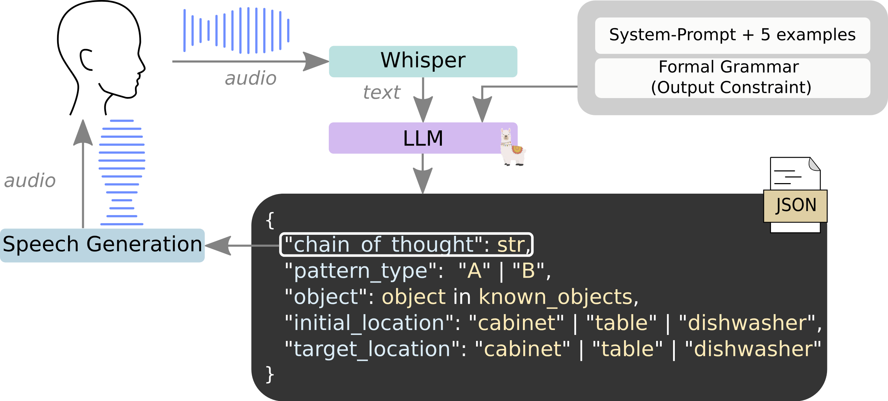

# Speech and Language Processing System for Eurobin Coopetition



This repository implements a **ROS-based speech and language processing framework** designed to support the Eurobin Coopetition. The system integrates **speech-to-text**, **large language models (LLMs)**, and **text-to-speech** functionalities across two interconnected modules.

---

## System Overview

### 1. **ASR + LLM Module ([`asr_llm`](https://github.com/hucebot/eurobin_llm_plan/tree/main/asr_llm))**
- **Purpose**: Captures audio from a microphone, transcribes it to text, and generates a structured plan that satisfies the Eurobin Coopetition setup.
- **Key Outputs**:
  - **Generated Plan**: A structured plan derived using advanced language models and custom grammars.
    - **Chain of Thought**: A step-by-step reasoning process (part of the generated plan) published for downstream use.
- **Technology Stack**:
  - [**faster-whisper**](https://github.com/SYSTRAN/faster-whisper)
  - [**Llama-cpp-python**](https://github.com/abetlen/llama-cpp-python)

### 2. **Speech Generation Module ([`speech_gen`](https://github.com/hucebot/eurobin_llm_plan/tree/main/speech_gen))**
- **Purpose**: Takes the **Chain of Thought** output from the `asr_llm` module and generates high-quality synthetic speech for human interaction.
- **Technology Stack**:
    - [**coqui-tts**](https://github.com/coqui-ai/TTS)


## Contact

For questions or support, please contact:
- Dionis Totsila: [dionis.totsila@inria.fr](mailto:dionis.totsila@inria.fr)


## Citing this work
If you use our code or part of it in your research, please cite our paper:
```bibtex
@misc{amadio2024vocalinstructionshouseholdtasks,
      title={From Vocal Instructions to Household Tasks: The Inria Tiago++ in the euROBIN Service Robots Coopetition}, 
      author={Fabio Amadio and Clemente Donoso and Dionis Totsila and Raphael Lorenzo and Quentin Rouxel and Olivier Rochel and Enrico Mingo Hoffman and Jean-Baptiste Mouret and Serena Ivaldi},
      year={2024},
      eprint={2412.17861},
      archivePrefix={arXiv},
      primaryClass={cs.RO},
      url={https://arxiv.org/abs/2412.17861}, 
}
```

---

## Acknowledgements
This research was supported by:
- CPER CyberEntreprises
- Creativ’Lab platform of Inria/LORIA
- EU Horizon project euROBIN (GA n.101070596)
- France 2030 program through the PEPR O2R projects AS3 and PI3 (ANR-22-EXOD-007, ANR-22-EXOD-004)

<div align="center">
    
</div>

